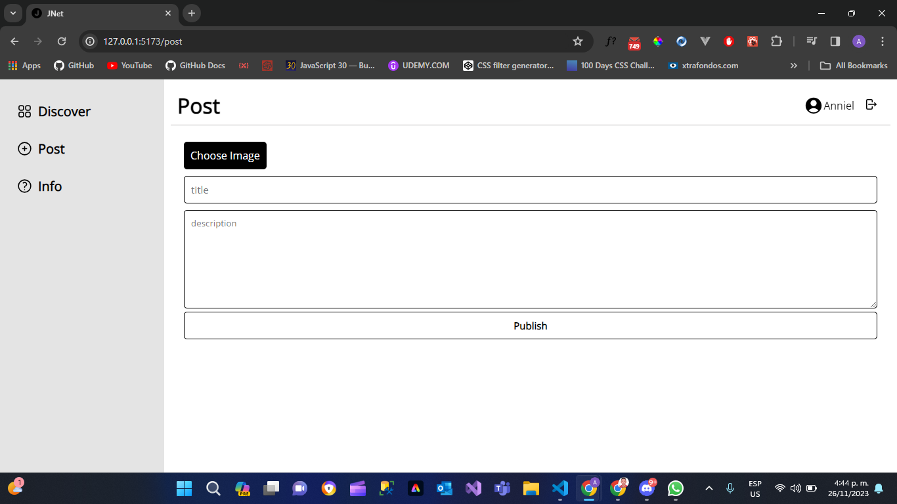
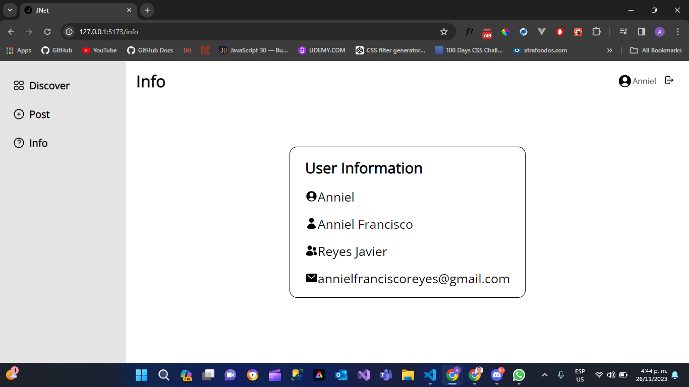

# Install the dependencies
```bash
npm install
```

# Run this app
```bash
npm run dev
```
Anniel Francisco Reyes Javier | 2022-0147

Credenciales de Prueba:
Correo: rperera@itla.edu.do Contraseña:123456

Sevidor con Firebase: https://github.com/Anniel-Francisco/Servidor_Muro_Interactivo.git  

Aqui se muestran las publicaciones


Desde aqui se cargan las publicaciones


Aqui se muestra la información de usuario


Este es el Log in


Aqui se registran los usuarios

